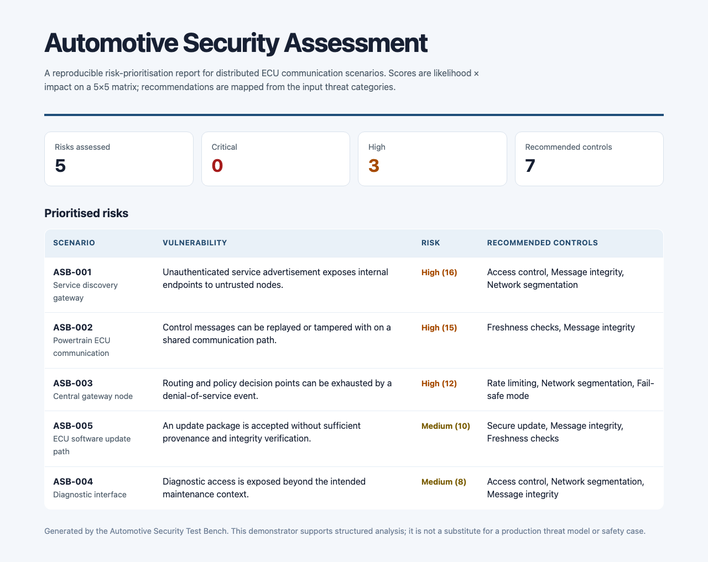
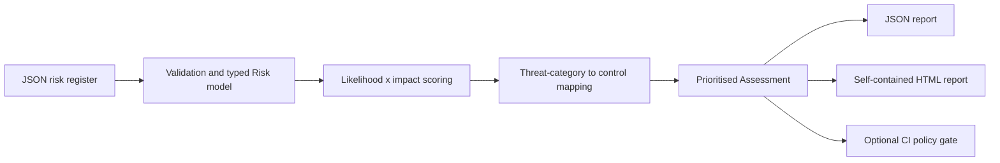

# Automotive Security Test Bench

[](https://github.com/mithulram/automotive-security-test-bench/actions/workflows/ci.yml)

A small, reproducible automotive cybersecurity assessment tool for prioritising ECU communication risks and producing reviewable JSON and HTML reports. It is intentionally transparent: the scoring model is a simple 5x5 likelihood-impact matrix and every control recommendation is traceable to threat categories supplied in the risk register.

> **Scope note:** This is a portfolio demonstrator inspired by university research. It is not a production threat-modelling platform, a vehicle-security product, or a substitute for a safety case.



## What it demonstrates

- Typed Python domain modelling and defensive input validation.
- A deterministic risk-prioritisation workflow for authentication, replay/tampering, denial-of-service, diagnostics, service-discovery, and update scenarios.
- Traceable security-control recommendations: message integrity, freshness checks, access control, segmentation, rate limiting, secure updates, and fail-safe modes.
- A CLI that creates machine-readable JSON and a self-contained, responsive HTML assessment report.
- Automated unit tests, a CI workflow, Docker packaging, documentation, and a reproducible synthetic demo dataset.

## Quick start

Requirements: Python 3.11 or newer.

```bash
git clone https://github.com/mithulram/automotive-security-test-bench.git
cd automotive-security-test-bench
python3 -m venv .venv
source .venv/bin/activate
python -m pip install --upgrade pip
python -m pip install -e .

auto-sec-bench assess \
  --input examples/ecu_risks.json \
  --json-out artifacts/assessment.json \
  --html-out artifacts/assessment.html
```

Open `artifacts/assessment.html` in a browser to view the report.

### Quality gate

```bash
python -m unittest discover -s tests -v
python -m compileall -q src tests

# Demonstrate a CI-style policy failure when a High or Critical risk is present.
auto-sec-bench assess --input examples/ecu_risks.json --fail-on high
```

The final command returns exit code `2` when the policy gate detects a risk at or above the selected threshold. That makes it suitable for a simple CI control without pretending it is a full security programme.

### Docker

```bash
docker build -t automotive-security-test-bench .
docker run --rm -v "$(pwd)/artifacts:/app/artifacts" automotive-security-test-bench
```

## Input schema

The tool accepts a JSON object with a `risks` array. Each risk requires an ID, asset, vulnerability, likelihood and impact scores from 1 to 5, and one or more threat categories.

```json
{
  "risks": [
    {
      "id": "ASB-001",
      "asset": "Service discovery gateway",
      "vulnerability": "Unauthenticated service advertisement exposes internal endpoints.",
      "likelihood": 4,
      "impact": 4,
      "threat_categories": ["authentication", "service-discovery"],
      "existing_controls": ["network-segmentation"]
    }
  ]
}
```

Supported threat categories are `authentication`, `denial-of-service`, `diagnostics`, `replay`, `service-discovery`, `tampering`, and `update`. Unknown categories are retained in the report but require manual control review instead of a fabricated recommendation.

## Scoring model

| Score | Severity | Meaning |
|---:|---|---|
| 1-5 | Low | Track and review in context. |
| 6-11 | Medium | Plan and validate mitigations. |
| 12-19 | High | Prioritise mitigation and review. |
| 20-25 | Critical | Escalate for immediate engineering and safety review. |

This score is a prioritisation aid only. It does not calculate residual risk, prove regulatory compliance, or replace automotive security engineering judgement.

## Architecture



More detail: [docs/architecture.md](docs/architecture.md).

## Repository structure

```text
src/automotive_security_bench/  Core domain, assessment, reporting, and CLI
examples/                      Synthetic ECU risk register
tests/                         Unit and CLI/report integration tests
docs/                          Architecture notes and report screenshot
.github/workflows/             GitHub Actions verification
```

## Resume-ready description

> Built a Python automotive-security assessment tool that validates ECU threat scenarios, prioritises risks with a 5x5 likelihood-impact model, maps mitigations to attack categories, and produces test-covered JSON and HTML reports for technical review.

## License

MIT. See [LICENSE](LICENSE).
